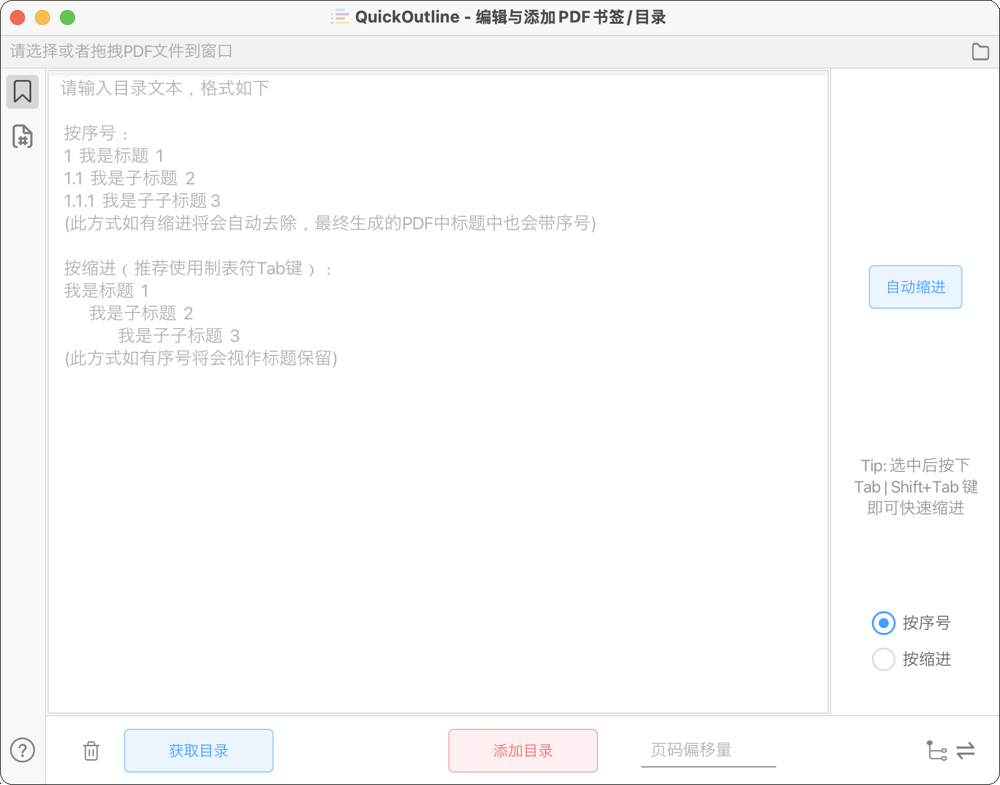

# QuickOutline

## 界面



## 使用方式
1. 拖动PDF文件到窗口
2. 写入目录文本，格式在下面
3. 设定 页面偏移量=PDF中的页码–原书的页码
4. 添加目录，完成！

### 按序号
```
1  我是标题  1
1.1  我是子标题  2
1.1.1  我是子子标题 3
```
此方式如有缩进将会自动去除，不会影响，最终生成的PDF中标题中也会带序号

### 按缩进（推荐使用制表符Tab键）
```
我是标题  1
    我是子标题  2
        我是子子标题  3
```
此方式如有序号将会视作标题，不会影响

### 查找想要的目录

1. 各大书评、卖书等网站，均能找到相应书的目录，这里推荐，京东、豆瓣、淘宝

2. PDF书籍中页面非图片（即文字可以选中）时，直接复制并粘贴到软件中 ★★★

演示


### Tips
1. 页码偏移量
添加目录时，会自动加上页码偏移量，支持负数，但相加后的结果不要超出实际页码范围

注：1.0 版本在获取当前PDF目录时，会自动减去页码偏移量；2.0+版本此按钮改为获取目录，不会有此行为，即页码偏移量仅会在添加目录时作用（相加）

2. 中文序号支持

> 请注意，仅支持部分可识别的中文序号，如 篇、章、节、部分

3. 自动缩进

自动缩进是按序号进行的

不仅仅是会自动缩进， 同时也会自动格式化：

- 自动切分，如
```
第一章我是标题21
->
第一章 我是标题 21
```


注意，使用自动缩进得到的文本层次结构，与直接使用按序号的方式添加的目录层次结构是一样的

主要用于在软件无法按序号识别某条目的层级时，可手动添加缩进进行快速层级微调，添加目录时记得选按缩进方式


## 使用 VSCode 以使用高级编辑功能

本软件不提供高级编辑功能（如正则表达式，VSCode 自带此功能）

如想使用，请使用软件中提供的 VSCode 按钮以启动

VSCode 中的内容会自动同步至软件窗口中（需在 VSCode 中保存文件，可以打开自动保存功能）

注意此同步是单项同步，即 VSCode → 本软件

但在此期间，你可以使用软件中的自动缩进功能，此时软件中文本也会立即至 VSCode 中

### 配置

请先下载 [VSCode](https://code.visualstudio.com/)

需要添加至环境变量，方法也很简单

### Windows

参考 [Visual Studio Code on Windows](https://code.visualstudio.com/docs/setup/windows)

安装时勾选"添加到 Path"（默认已勾选，用户无需进行任何操作），安装后需重启

> **Tip:** 若在下载时将其不慎取消勾选，可在找到安装目录下的 bin 文件夹，将其添加到系统环境变量中的 Path

### MacOS

参考 [Visual Studio Code on macOS](https://code.visualstudio.com/docs/setup/mac#_launching-from-the-command-line)

1. 启动 VSCode.

2. 按下组合键 (Cmd+Shift+P)，输入 'shell command' 找到命令行: Install 'code' command in PATH command.

## 开源软件使用

- iText (AGPL Licence)

## 下载

Windows: 解压后直接运行 `.exe` 文件

Mac: 提供安装包，目前打开所生成的 PDF 文件所在位置功能有点小问题，不可用

[下载地址](https://github.com/ririv/QuickOutline/releases)

---

## 构建、运行、打包（非开发人员略过）

### 版本一致性
为确保兼容，请保证版本一致性，目前项目采用：
- Java 21 (LTS)
- JavaFX 21 (LTS)
- Gradle 8.12

由于项目使用了 jlink 打包需要模块化项目，却引用了非模块化项目（iText），因此需要注意在 Gradle 中处理模块化问题
```
plugins {
    ...
    id 'org.openjfx.javafxplugin' version '0.1.0'
    // 参考 https://github.com/openjfx/javafx-gradle-plugin#extra-plugins
    // 不加入此会出现找不到模块错误
    id 'org.javamodularity.moduleplugin' version '1.8.15'
    
    // 请使用高版本，'2.26.0'实测出现 "Unsupported class file major version 65"错误
    id 'org.beryx.jlink' version '3.1.1'
}
```

### 运行问题
请使用 Gradle 下的 Run 任务，不要使用IDEA自带的Main入口处运行（App）

### 打包问题
运行 `Gradle - build - jpackageImage` 任务可以直接成功打包成应用镜像（可执行文件）

运行 `jpackage` 任务则打包成安装包文件，在生成安装包时，需要操作系统相关的工具，例如：
- Windows：需要安装 WiX Toolset。
- macOS：需要 Xcode 和开发者签名。
- Linux：需要 dpkg 或 rpm。

> **Note:** jpackage 依赖于旧版本的 WiX，提示"找不到 WiX 工具 (light.exe, candle.exe)"
> 
> 因此请使用 WiX 3，并确保它添加到环境变量

### Windows下开发控制台输出中文乱码问题 TODO
打包时可能会出现日志乱码问题，设置UTF-8无果，临时解决方案（设置 GBK 编码）：

Gradle 运行配置（jpackage 等，你需要运行的任务）- 虚拟机选项（VM options）-添加
```
-Dfile.encoding=GBK
```


## TODO
- 树可编辑
- 树可拖拽
- 树可升降级
- TOC读取和识别
- TOC插入
- 设置缩放模式
- 自定义正则表达式
- 页码罗马数字支持
- 文档分析生成目录
