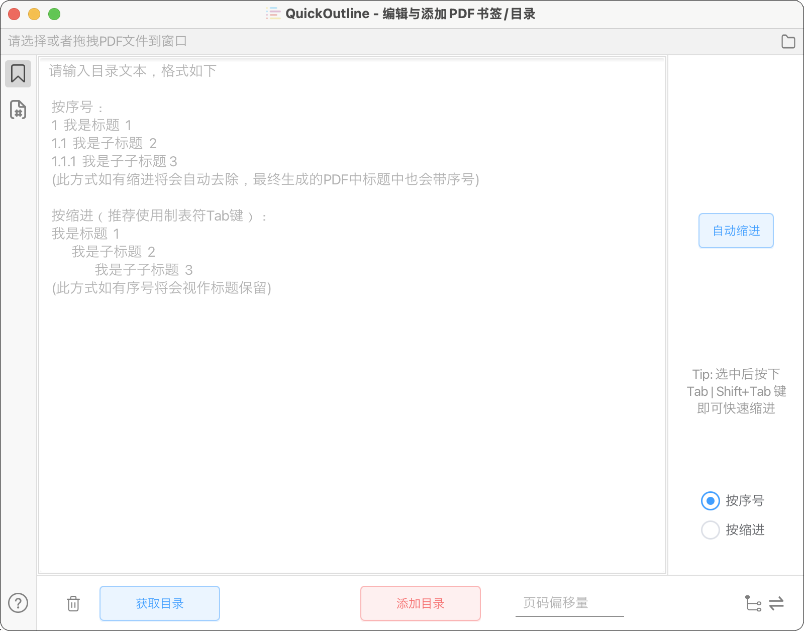

# QuickOutline

QuickOutline 是一个专注于 **PDF 目录 / 书签（Outline / Bookmark）编辑** 的桌面工具。它可以把文本目录写入 PDF，也可以从已有 PDF 书签中导出目录文本，适合整理电子书、教材、论文和长文档。

当前版本：`3.0.0-pre`



---

## 主要功能

- 给 PDF 添加、编辑和导出目录书签
- 支持按序号或按缩进解析目录文本
- 支持页码偏移，适配 PDF 页码与书籍页码不一致的情况
- 支持设置目录跳转缩放模式
- 文本视图与树视图双向编辑
- 支持从已有 PDF 书签载入目录
- 支持从文字类 PDF 中提取 TOC 作为目录参考
- 支持页面标签（Page Label）
- 支持命令行导入 / 导出目录
- 支持 Windows、macOS、Linux
- 支持中文和英文界面，会根据系统语言自动切换

> QuickOutline 不支持 OCR。扫描版 / 图片版 PDF 需要先使用系统 OCR、PowerToys、专业 OCR 软件或其他工具提取文本目录。

---

## 桌面端使用

1. 选择或拖入 PDF 文件。
2. 在目录文本区域输入或粘贴目录。
3. 设置页码偏移量：`PDF 中的页码 - 原书中的页码`。
4. 选择解析方式和缩放模式。
5. 点击添加目录并保存 PDF。

### 目录文本格式

#### 按序号

```text
1  我是标题  1
1.1  我是子标题  2
1.1.1  我是子子标题  3
```

这种方式会根据标题序号解析层级。写入 PDF 后，标题中的序号会保留。

#### 按缩进

```text
我是标题  1
    我是子标题  2
        我是子子标题  3
```

这种方式会根据缩进解析层级。推荐使用 Tab 或统一宽度的空格。

### 页码偏移

添加目录时，QuickOutline 会给目录文本中的页码加上页码偏移量。

例如：原书目录写的是第 1 页，但 PDF 阅读器里实际对应第 12 页，则偏移量为：

```text
12 - 1 = 11
```

页码偏移支持负数，但相加后的结果不能超出 PDF 实际页码范围。

### 自动缩进

自动缩进会根据序号整理目录层级，并尽量格式化标题和页码，例如：

```text
第一章我是标题21
```

会被整理为：

```text
第一章 我是标题 21
```

> 中文序号识别只覆盖常见形式，例如“篇、章、节、部分”等。

---

## 命令行 CLI

安装桌面应用后，可以使用 `quickoutline` 命令进行目录导入和导出。

### 导入目录到 PDF

```bash
quickoutline outline import --pdf input.pdf --outline toc.txt
```

常用参数：

```bash
quickoutline outline import \
  --pdf input.pdf \
  --outline toc.txt \
  --output output.pdf \
  --offset 0 \
  --method seq \
  --view-mode none
```

参数说明：

| 参数 | 说明 |
| --- | --- |
| `--pdf` | 输入 PDF 路径，必填 |
| `--outline` | 目录文本路径，必填 |
| `--output` | 输出 PDF 路径，不填时生成 `*_new.pdf` |
| `--offset` | 页码偏移，默认 `0` |
| `--method` | 解析方式：`seq` 或 `indent`，默认 `seq` |
| `--view-mode` | 跳转缩放模式，默认 `none` |

`--view-mode` 可选值：

```text
none
fit-to-page
fit-to-width
fit-to-height
fit-to-box
actual-size
```

### 从 PDF 导出目录

```bash
quickoutline outline export --pdf input.pdf
```

常用参数：

```bash
quickoutline outline export \
  --pdf input.pdf \
  --output outline.txt \
  --offset 0
```

参数说明：

| 参数 | 说明 |
| --- | --- |
| `--pdf` | 输入 PDF 路径，必填 |
| `--output` | 输出目录文本路径，不填时生成 `*_outline.txt` |
| `--offset` | 导出时应用的页码偏移，默认 `0` |

---

## 获取目录文本的方式

- 如果 PDF 本身已经有书签，打开后可以直接载入并微调。
- 如果是文字类 PDF，可以尝试使用内置的 TOC 提取功能。
- 可以从出版社、书评网站、电商页面等来源复制目录。
- 可以借助 AI 或 OCR 工具识别目录文本，再粘贴到 QuickOutline 中整理。

---

## 下载与安装

请到 [GitHub Releases](https://github.com/ririv/QuickOutline/releases) 下载对应平台的安装包。

### Windows

- 推荐下载安装包。
- 如果使用压缩包版本，解压后直接运行程序。

### macOS

- 推荐下载 `dmg` 安装包。

如果打开应用时提示“文件已损坏”，请打开终端执行：

```bash
xattr -cr /Applications/QuickOutline.app
```

如果 App 不在“应用程序”文件夹，请把路径替换为实际路径，例如：

```bash
xattr -cr ~/Downloads/QuickOutline.app
```

### Linux

- 支持 `deb`、`rpm` 和 `AppImage` 等包格式。
- 当前主要测试环境为 Ubuntu 22.04。

如果安装时缺少系统依赖，请按发行版提示安装对应包。

如果在 WSL2 中安装桌面包时遇到：

```text
xdg-desktop-menu: No writable system menu directory found.
```

通常是因为 WSL2 没有完整图形桌面环境。可以尝试：

```bash
sudo mkdir -p /usr/share/desktop-directories/
```

---

## ☕ 感谢支持！

如果您觉得 QuickOutline 对您有帮助，欢迎通过以下方式支持我，您的支持是我持续维护和开发新功能的巨大动力！

*   **关注我的小红书**  <a href="https://www.xiaohongshu.com/user/profile/5f988414000000000101ca29"></a>

[//]: # (*   **请我喝杯咖啡**  [微信支付]&#40;https://your_wechat_payment_link.com&#41; | [支付宝]&#40;https://your_alipay_payment_link.com&#41;)
